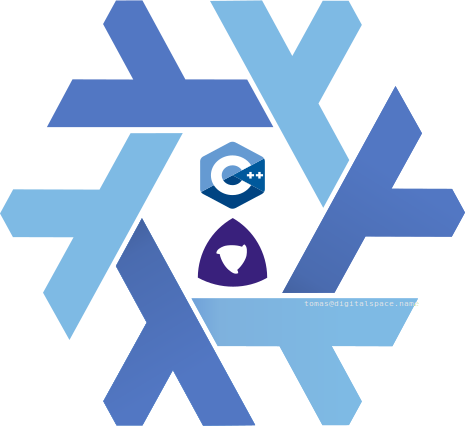

NixonCpp
========

<p align="center">
	
</p>

Overview
--------
Small C++ application + library with Meson/Nix tooling, tests, and packaging.  
>Evolved from a [DotNameCpp](https://github.com/tomasmark79/DotNameCpp) template originally built with CMake.

Repository layout
-----------------
- include/                Public library headers
- src/app/                Application sources
- src/lib/                Library implementation
- tests/                  Unit tests
- assets/                 Runtime assets
- scripts/                Build and tooling scripts

Requirements
------------
- Nix (recommended) or a C++20 toolchain + Meson + Ninja
- Optional: doxygen + graphviz for docs

Quick start (Nix)
-----------------
direnv allow
make build

Template rename
---------------
Run once after cloning:
```bash
- Usage: scripts/rename.sh <NewName> [NewLibName] [NewNamespace]  
Example: rename.sh MyApp MyAppLib myapp
```
Note: For repeated renames, edit OLD_NAME/OLD_LIB/OLD_NS in scripts/rename.sh manually.

Build and test
--------------
- make build              Native release build
- make debug              Native debug build
- make test               Run tests
- make format             clang-format
- make check              clang-tidy

Cross builds
------------
- make cross-aarch64
- make cross-windows
- make cross-wasm

Packaging
---------
- make package-native
- make package-aarch64
- make package-windows
- make package-wasm

Documentation
-------------
make doxygen
Output: docs/html/index.html

VS Code tasks
-------------
Key workflow entry point for day-to-day work:
- F7: fast build (native debug)
- Shift+F7: task picker

Configure Meson options
-----------------------
meson configure build/builddir-debug -Dbuild_tests=enabled

License
-------
MIT
