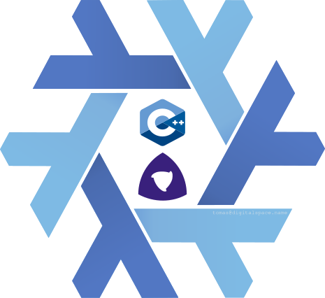

# NixonCpp

[](https://github.com/tomasmark79/NixonCpp/actions/workflows/quality.yml)
[](https://github.com/tomasmark79/NixonCpp/actions/workflows/native.yml)
[](https://github.com/tomasmark79/NixonCpp/actions/workflows/static-analysis.yml)
[](https://github.com/tomasmark79/NixonCpp/actions/workflows/sanitizers.yml)
[](https://github.com/tomasmark79/NixonCpp/actions/workflows/cross-builds.yml)
[](https://github.com/tomasmark79/NixonCpp/actions/workflows/docs.yml)

<p align="center">
  
</p>

## Create your C++ applications and libraries

A starting point for command-line applications and reusable C++ libraries, built with **Meson** and reproducible **Nix** environments.

Native tests, static analysis, sanitizers, and packaging — with cross-compilation for **Linux ARM64**, **Windows**, and **WebAssembly**.

## Application and documentation

- [Run NixonCpp in your browser](https://tomasmark79.github.io/NixonCpp/) — WebAssembly debug build; C++ sources are available in DevTools under `debug-src/src`.
- [Browse the API documentation](https://tomasmark79.github.io/NixonCpp/html/index.html) — Doxygen reference for the C++ application and library.

## Quick start

For a first native build on Linux, have **Git** and **Nix with flakes enabled** installed. The Nix shell supplies the compiler, build tools, and project dependencies. Its first launch may take a while as packages are downloaded.

```bash
git clone https://github.com/tomasmark79/NixonCpp.git
cd NixonCpp
nix develop ./nix

# Build and run the native debug application
make debug
./build/builddir-debug/NixonCpp

# Run the test suite
make test
```

Run the build, application, and tests from the repository root inside the Nix shell. The sample application prints its detected platform, initializes the library, reports `Successfully loaded asset: NixonCppLogo.svg`, and exits. The test command should finish with no failures.

## Where to start

Start with [src/app/Application.cpp](src/app/Application.cpp), which contains `main()`, command-line options, and the sample application flow. Change its behavior, then repeat the build and run commands above.

| Location | Purpose |
| --- | --- |
| [src/app/](src/app/) | Application entry point and behavior |
| [src/lib/](src/lib/) | Library implementation and shared utilities |
| [include/](include/) | Public library headers |
| [assets/](assets/) | Runtime assets and the WebAssembly HTML shell |
| [tests/](tests/) | Unit tests and their Meson configuration |
| [meson.build](meson.build) | Build targets, source lists, dependencies, and compiler options |
| [nix/](nix/) | Reproducible development environments and cross-compilation toolchains |

For reusable functionality, edit [src/lib/NixonCppLib.cpp](src/lib/NixonCppLib.cpp) and its public interface in [include/NixonCppLib/NixonCppLib.hpp](include/NixonCppLib/NixonCppLib.hpp). Add tests under `tests/` and register new source files in the appropriate `meson.build` file.

## Make it your own

Follow [Creating your own project](docs/creating-your-own-project.md) to rename the template, update project metadata and attribution, and configure CI and publishing for your repository.

## Features

- C++20 by default
- Application, shared library, and static library targets
- Nix development environments and reproducible package builds
- GoogleTest, clang-format, clang-tidy, AddressSanitizer, and UBSan
- Cross-builds for aarch64-linux, Windows, and WebAssembly
- Doxygen documentation published through GitHub Pages
- Project renaming, packaging, VS Code, devcontainer, and Codespaces support

## Further guides

- [Build targets and packaging](docs/build-targets.md) — native Linux, Linux ARM64, Windows, and WebAssembly builds, build types, and deployable packages.
- [Debugging](docs/debugging.md) — native debugging with GDB and browser debugging with C++ source maps.
- [Development tools](docs/development-tools.md) — tests, formatting, static analysis, sanitizers, and editor integration.

## Why I built this

The older I get, the more I look for real simplicity in what I do. I built this template for myself out of a desire for one comprehensive, reusable development environment for software that can serve different purposes and run across platforms. A consistent foundation lets me spend less time putting the tools together and more time building the software itself. 🙂

On my NixOS system, a single command — `make package-all` — now builds the application for native Linux, Linux ARM64, Windows, and WebAssembly, and packages the results into separate deployment archives.

## Support

If NixonCpp helps with your projects, you can support its development:

[](https://paypal.me/TomasMark)

## Authorship and AI assistance

This template was designed and developed through human effort. AI was used as an assistant during later stages of development; it was not used to randomly assemble the project. The architecture, implementation decisions, and responsibility for the result remain with the author.

## License

[MIT](LICENSE)
